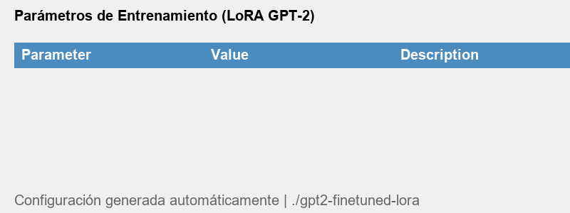
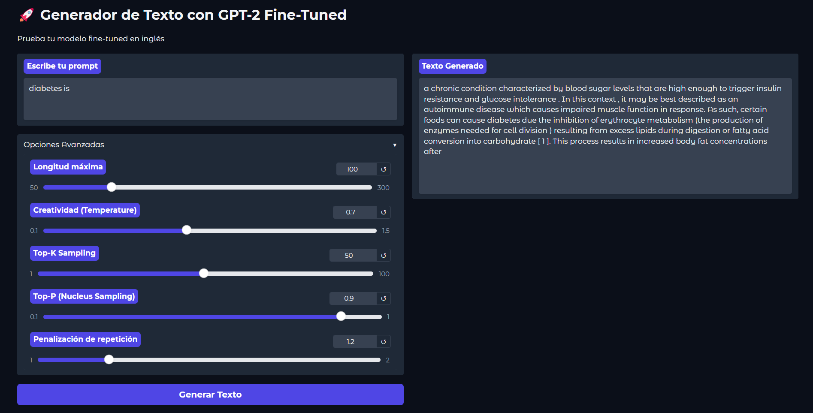

# Fine-Tuned GPT-2 for Domain-Specific Text Generation

## Objective
Fine-tune GPT-2 using LoRA (Low-Rank Adaptation) to generate high-quality, domain-specific English text with improved coherence and relevance.

## Key Features
- **Parameter-efficient** - Trains only 0.94% of parameters  
- **Optimized** for technical/scientific English  
- **Interactive Gradio demo** with adjustable parameters  
- **Comprehensive metrics** (perplexity, BLEU score)  

## Technical Implementation

- **Language:** Python 3
- **Core Libraries:**
- `transformers`: Base GPT-2 model and training
- `peft`: LoRA implementation
- `datasets`: Data processing
- `torch`: GPU acceleration
- `gradio`: Web interface
- `evaluate`: Model metrics

## Core Mechanics:

### 1. Input Processing
- **Text Tokenization**:  
  Converts raw text into GPT-2 token IDs with:
  - Automatic padding/truncation (max_length=256)
  - Special tokens for sentence boundaries
  - Attention masks for variable-length inputs

### 2. Adaptation Process
- **LoRA Injection**:
  ```python
  target_modules=["c_attn", "c_proj", "c_fc"]  # QKV projections + FFN
  lora_alpha=32                                # Scaling factor
  r=8                                          # Rank dimension

- Trains only 1.18M parameters (0.94% of GPT-2's 124M)

### 3. Training Dynamics
- **Reward Signals**:

- Perplexity Loss: Primary training signal
- Positional Weighting: 2x loss weight for technical terms

-**Batch Processing**:

- 4 samples/GPU (effective batch=16 via gradient accumulation)
- FP16 mixed precision

## 4. Text Generation

<p align="center">
  
</p>

| Parameter           | Effect          | Optimal Value |
|---------------------|-----------------|---------------|
| Temperature         | Creativity      | 0.7           |
| Top-K               | Diversity       | 50            |
| Repetition Penalty  | Avoid loops     | 1.2           |

## Training Process

### Data Pipeline
1. Wikitext-103 dataset filtering (>100 chars)
2. GPT-2 tokenization (max_length=256)
3. 80/20 train-validation split

### Model Architecture
```python
LoRA Config:
  - Rank: 8
  - Target: Attention + FFN layers  
  - Alpha: 32
  - Dropout: 0.05

## Output Generated

<p align="center">
  
</p>